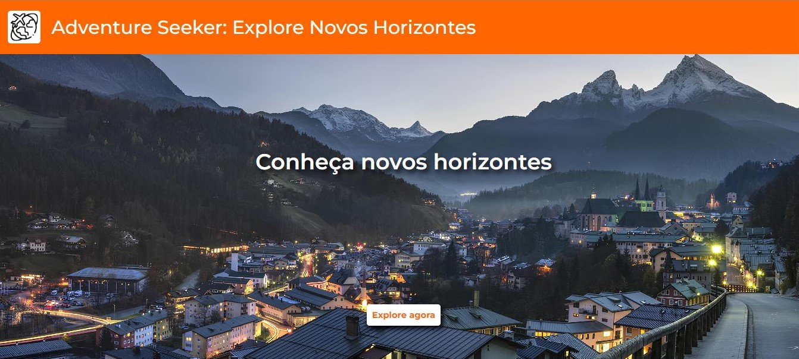
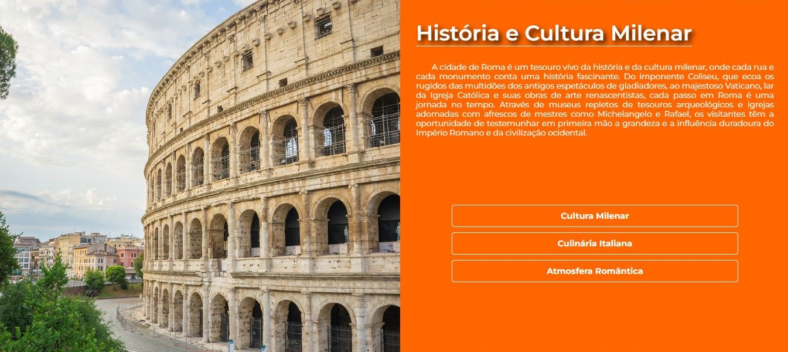
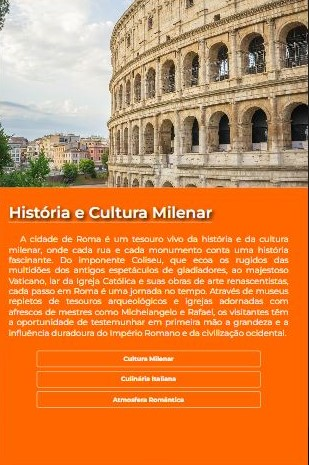

# Adventure Seeker

Este projeto foi desenvolvido como uma prática para aprimorar as habilidades em HTML, CSS e JavaScript. O site apresenta uma série de destinos de viagem, com ênfase especial na técnica de paralaxe. Entre os destinos abordados estão Roma, Nova York e Kioto. Além disso, incorpora botões interativos que permitem ao usuário alternar entre diferentes tópicos em cada seção de texto.

## Tecnologias Utilizadas

 

Neste projeto foi utilizado a Biblioteca AOS para animações nos textos

## Capturas de tela

### Responsividade

